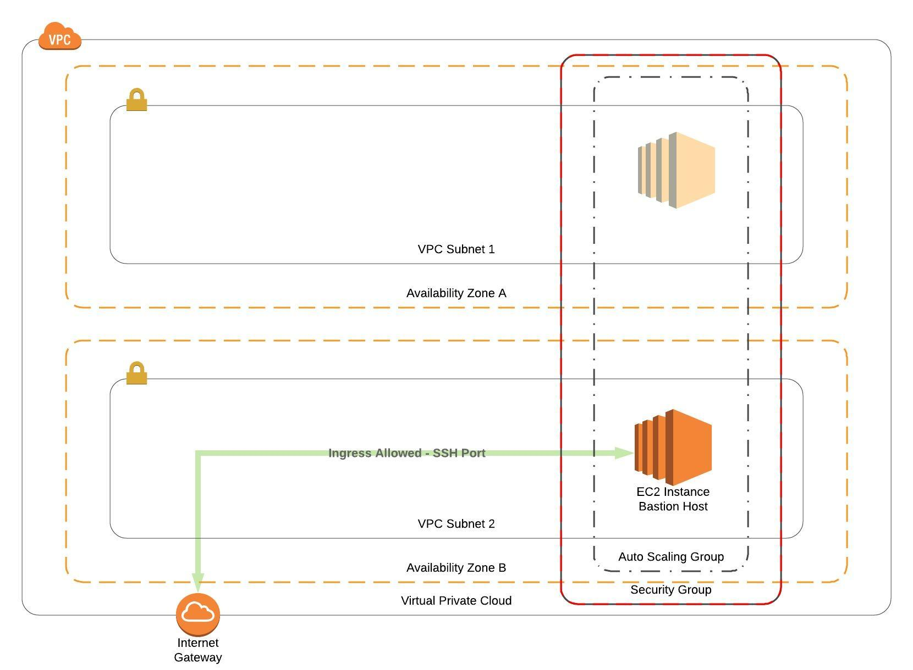

# AWS CloudFormation Bastion Host Example Template
---
This template is used to create a CloudFormation Stack that implements a single EC2 Instance running AWS Linux 2, and an associated Security Group.  The Security Group provides secure access to the bastion host based upon the provided origin cidr block and SSH port.  SSH access to the Bastion Host is granted using the default ec2-user credentials associated with the AWS Linux 2 AMI, and the SSH key pair supplied via the KeyPair parameter.



The EC2 instance is created using an AutoScaling group provisioned across two subnets that are associated with two different availability zones.  The AutoScaling Group is configured for a minimum of one instance, a desired count of one instance, and a maximum of one instance.  The 1-1-1 AutoScaling configuration ensures the bastion host will remain available even in the event of an availability zone failure.

<br />

## Getting Started
---
At a minimum, access to an AWS Account and permissions to deploy all of the resources defined in the template from the CloudFormation console are required. In addition, you will also require a key pair associated with the account/vpc you are deploying the host into.  EC2 key pairs can be created in the console, or from the aws cli (*see example below*).  

If you would like to deploy the template from the commandline a set of CLI credentials with the permissions to deploy all of the resources defined in the template and the installation and configuration of AWS CLI is required.

## Prerequisites
---
* Installing AWS CLI: https://docs.aws.amazon.com/cli/latest/userguide/cli-chap-install.html
* Configuring AWS CLI: https://docs.aws.amazon.com/cli/latest/userguide/cli-chap-configure.html
* Creating EC2 Key Pair (aws console): https://docs.aws.amazon.com/AWSEC2/latest/UserGuide/ec2-key-pairs.html#having-ec2-create-your-key-pair
* Creating EC2 Key Pair (aws cli):
  
        aws ec2 create-key-pair \ 
            --key-name MyKeyPair \
            --query 'KeyMaterial' \
            --output text > ~/.ssh/MyKeyPair.pem 
        
        chmod 400 ~/.ssh/MyKeyPair.pem 

<br />

## Deploying via AWS CLI
---
 Create a param-overrides.json file to store the template parameter values.

 *Example*:
 ```
 [
    "VpcId=vpc-123456789abcdefgh",
    "KeyPair=MyKeyPair",
    "Subnet1=subnet-123456789abcdefgh",
    "Subnet2=subnet-abcdefghi12345678",
    "InstanceType=t3.micro",
    "SourceCidr=1.1.1.1/32",
    "SshPort=22"
]
 ```

Create the tags.json file and populate with all necessary tags.

*Example*:
```
[
    "Business_Unit=1Strategy",
    "Owner=John Doe",
    "Project=Bastion Host"
]
```


 Deploy the template to your account/environment:
 ```
aws cloudformation deploy \
    --template-file bastion_host.yaml \
    --stack-name JohnDoeBastionHost \
    --tags file://tags.json \
    --region "us-east-1" \
    --parameter-overrides file://param-overrides.json
 ```

 <br />

 ## Authors
 ---
* Will Nave - [1Strategy](https://www.1strategy.com)

<br />

## License
---
Copyright 2019 1Strategy

Licensed under the Apache License, Version 2.0 (the "License"); you may not use this file except in compliance with the License. You may obtain a copy of the License at

http://www.apache.org/licenses/LICENSE-2.0

Unless required by applicable law or agreed to in writing, software distributed under the License is distributed on an "AS IS" BASIS, WITHOUT WARRANTIES OR CONDITIONS OF ANY KIND, either express or implied. See the License for the specific language governing permissions and limitations under the License.

<br />

## References
---
* Amazon EC2 Key Pairs: https://docs.aws.amazon.com/AWSEC2/latest/UserGuide/ec2-key-pairs.html
* AWS Auto Scaling User Guide: https://docs.aws.amazon.com/autoscaling/plans/userguide/what-is-aws-auto-scaling.html
* AWS CloudFormation Best Practices: https://docs.aws.amazon.com/AWSCloudFormation/latest/UserGuide/best-practices.html 
* AWS CloudFormation Template Reference: https://docs.aws.amazon.com/AWSCloudFormation/latest/UserGuide/template-reference.html 
